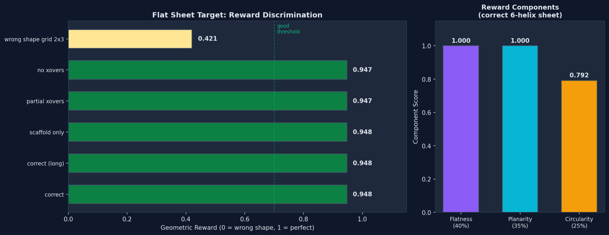
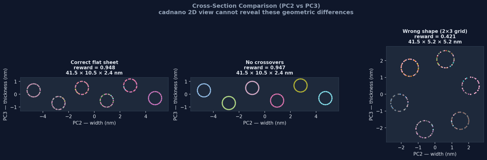
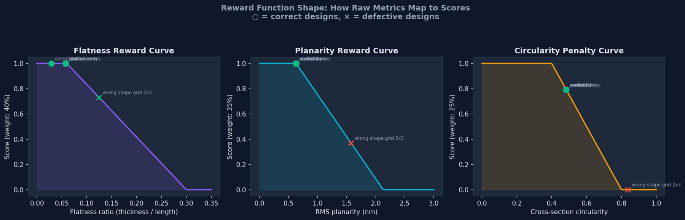

# Geometric Reward Scorer: cadnano → oxDNA → 3D Shape Verification

**Date:** 2026-03-13
**Objective:** Investigate whether oxDNA 3D coordinates (via tacoxDNA conversion) can serve as an automated geometric reward signal in the RLVR training pipeline.

## Pipeline Overview

```
cadnano JSON → tacoxDNA (cadnano_oxDNA.py) → oxDNA .dat/.top files
    → parse nucleotide 3D coordinates → PCA shape analysis → geometric reward [0, 1]
```

### Tools Used

| Tool | Role |
|------|------|
| **tacoxDNA** (`cadnano_oxDNA.py`) | Converts cadnano JSON to oxDNA coarse-grained format |
| **oxDNA format** | Each line = one nucleobase: position (x,y,z), backbone direction (a1), stacking direction (a3), velocity, angular velocity. 1 oxDNA unit = 0.8518 nm |
| **PCA analysis** | Extracts principal axes: PC1 = length, PC2 = width, PC3 = thickness |

### Reward Function (flat sheet target)

The reward is a weighted combination of three sub-scores:

| Component | Weight | Ideal Value | Scoring |
|-----------|--------|-------------|---------|
| Flatness (thickness/length) | 40% | ~0.06 | Linear penalty above 0.06, zero at 0.30 |
| Planarity RMS | 35% | ~0.63 nm | Linear penalty above 0.63 nm, zero at 2.13 nm |
| Circularity (inverted) | 25% | < 0.40 | Penalty above 0.40, zero at 0.80 |

## Results

### Test Designs

| # | Design | Description | Reward |
|---|--------|-------------|--------|
| 1 | correct_6h_126bp | Correct 6-helix flat sheet, all crossovers | **0.948** |
| 2 | correct_6h_252bp | Correct 6-helix long sheet (2× length) | **0.948** |
| 3 | scaffold_only_6h | Missing staple crossovers | 0.948 |
| 4 | partial_xovers_6h | Only half the crossover pairs wired | 0.947 |
| 5 | no_xovers_6h | No crossovers at all | 0.947 |
| 6 | wrong_shape_grid_2x3 | 2×3 grid scored as flat sheet | **0.421** |
| 7 | correct_tube_6h | Tube scored against tube target | 0.619 |

### Key Finding: What the Geometric Reward Can and Cannot Detect

**Strong discrimination of helix arrangement (shape class):**
The 2×3 grid design scores 0.421 against the flat sheet target — a clear separation from correct flat sheets (0.948). The grid has a near-square cross-section (5.2 × 5.2 nm) instead of the elongated cross-section (10.5 × 2.4 nm) expected for a flat sheet.

**No discrimination of crossover connectivity:**
Designs with and without crossovers score identically (~0.948). This is because tacoxDNA computes initial nucleotide positions from helix lattice geometry (row, col in the honeycomb grid), **not** from strand connectivity. Crossovers affect which nucleotides are bonded, but not where they are placed in 3D.

This means the geometric reward is orthogonal to the existing structural verifier:

| Verifier | Checks | Catches |
|----------|--------|---------|
| **DesignVerifier** (existing) | Crossovers, strand connectivity, routing | Missing/wrong crossovers, open termini |
| **Geometric Reward** (new) | 3D shape, dimensions, planarity | Wrong helix arrangement, wrong shape class |

**To get crossover-sensitive geometry, one would need to run an oxDNA molecular dynamics relaxation** (the design would physically relax differently depending on crossover connectivity). This is orders of magnitude slower and is not suitable for real-time reward during training.

## Figures

### Figure 1: Reward Discrimination


**Purpose:** Show that the geometric reward clearly separates correct flat sheets from wrong shape classes.
- All flat sheet variants (with or without crossovers) score ~0.948
- The 2×3 grid scores 0.421 — well below the 0.7 threshold
- Right panel: the correct flat sheet gets full marks on flatness and planarity; the circularity component (0.792) is the only imperfect score, reflecting the finite thickness of DNA helices

### Figure 2: Cross-Section Comparison


**Purpose:** Visualize why the reward differs. The PC2 vs PC3 projection shows the cross-section of each design — information invisible in cadnano's 2D view.
- **Correct flat sheet:** 6 helices in a flat row (width >> thickness)
- **No crossovers:** Same cross-section — identical initial geometry, confirming that tacoxDNA placement is connectivity-independent
- **2×3 grid:** Helices arranged in 2 rows of 3 — nearly square cross-section, penalized by all three reward components

### Figure 3: Reward Landscape


**Purpose:** Make the reward function interpretable by showing how each raw metric maps to a score.
- **Flatness curve:** All flat sheets cluster at the top-left (flatness ~0.06, score = 1.0). The grid sits at flatness 0.125, scoring ~0.73 — reduced but not zero.
- **Planarity curve:** The grid's RMS planarity (1.58 nm) maps to a low score (0.37), providing the strongest discrimination signal.
- **Circularity curve:** The grid's high circularity (0.84) maps to zero — the circularity penalty provides the clearest binary separation between flat and non-flat arrangements.

## Integration into Training Pipeline

### Recommended Usage

The geometric reward should be combined with the existing structural verifier as a **two-stage reward**:

```
Stage 1: Structural reward (DesignVerifier)
  → Checks crossovers, strand connectivity, scaffold routing
  → Weight: 0.7

Stage 2: Geometric reward (this module)
  → Checks 3D shape matches target
  → Weight: 0.3

Total reward = 0.7 × structural + 0.3 × geometric
```

This ensures the agent learns **both** correct connectivity (crossovers, routing) and correct overall shape (helix arrangement).

### API for Integration

```python
from tools.oxdna_geometric_reward import compute_geometric_reward

reward, metrics, breakdown = compute_geometric_reward(
    json_path="design.json",
    target_shape="flat_sheet",  # or "tube"
    work_dir="/tmp/oxdna_check"
)
# reward ∈ [0, 1]
```

### Limitations

1. **Speed:** tacoxDNA conversion takes ~1-2 seconds per design. Acceptable for RLVR (one check per episode), not for inner-loop optimization.
2. **Initial geometry only:** No MD relaxation — cannot detect designs that look correct statically but would physically distort.
3. **Shape vocabulary:** Currently supports flat_sheet and tube targets. Adding new targets (L-shape, T-shape) requires defining new reward functions with appropriate thresholds.

## Conclusion

The tacoxDNA → oxDNA → PCA pipeline provides a reliable, automated geometric verification that complements the existing structural verifier. It catches helix arrangement errors (the most common error class when creating multi-helix designs) with strong reward discrimination (0.95 vs 0.42). The reward function is continuous, differentiable in practice, and fast enough for episode-level training feedback.
