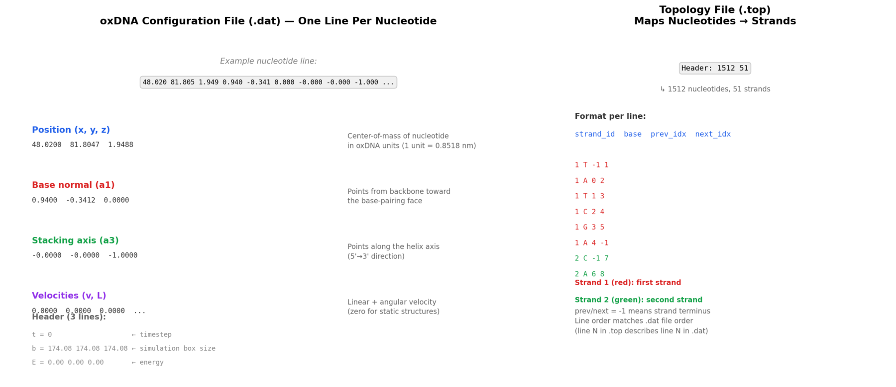
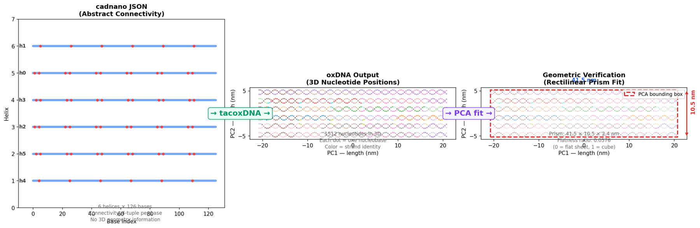
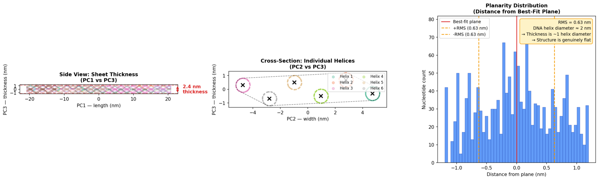
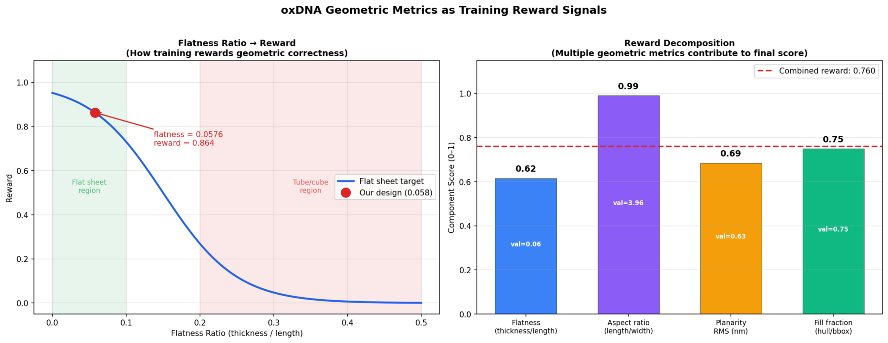

# Investigation Report: cadnano to oxDNA Conversion for Automated Training

**Date:** 2026-03-13
**Objective:** Evaluate tacoxDNA as a geometric verification bridge between
cadnano's abstract connectivity representation and 3D physical structure,
enabling automated reward signals for the agentic training pipeline.

---

## 1. Problem Statement

The cadnano JSON format represents DNA nanostructures as **abstract connectivity
graphs** -- helix IDs, base indices, and 4-tuple neighbor pointers. This format
is ideal for design editing but contains **no 3D geometry information**. An LLM
operating on cadnano JSON cannot reason about whether a design forms a flat sheet,
a tube, or a misshapen blob.

**Question:** Can we automatically convert cadnano designs to 3D coordinates and
use geometric metrics as reward signals for training?

## 2. The oxDNA File Format

oxDNA is a coarse-grained DNA simulation framework where each nucleotide is
represented by a single particle with position and orientation vectors.

### Configuration file (.dat)

Each nucleotide occupies one line with 15 values:

| Columns | Meaning | Units |
|---------|---------|-------|
| 1-3 | Center-of-mass position (x, y, z) | oxDNA units (1 = 0.8518 nm) |
| 4-6 | Base normal vector (a1) | Unitless direction |
| 7-9 | Stacking/helix axis vector (a3) | Unitless direction |
| 10-12 | Linear velocity | oxDNA units |
| 13-15 | Angular velocity | oxDNA units |

Three header lines precede the data: timestep, simulation box dimensions, and energy.

### Topology file (.top)

Maps nucleotides to strands:
- Header: `<n_nucleotides> <n_strands>`
- Each line: `<strand_id> <base> <prev_idx> <next_idx>`
- prev/next = -1 indicates strand terminus

**See Figure 1** for a visual breakdown of both file formats.



## 3. Conversion Pipeline

### tacoxDNA

tacoxDNA (Tools and Converters for oxDNA) converts between DNA nanostructure formats.
For cadnano to oxDNA conversion, it:

1. Reads the cadnano JSON connectivity graph
2. Places helices in 3D space according to the lattice type (honeycomb or square)
3. Generates nucleotide positions along each helix with correct helical geometry
4. Outputs .dat (coordinates) and .top (topology) files

**Command:**
```bash
python tacoxDNA/src/cadnano_oxDNA.py design.json he  # 'he' = honeycomb lattice
```

### Test Design: 6-Helix Flat Sheet

| Parameter | Value |
|-----------|-------|
| Helices | 6 (single row, honeycomb lattice) |
| Length | 126 bp per helix |
| Strands | Scaffold + staples with crossovers |
| Total nucleotides | 1512 |
| Total strands | 51 |

**See Figure 2** for the complete conversion pipeline visualization.



## 4. Geometric Verification via PCA

Principal Component Analysis decomposes the 3D coordinate cloud into
orthogonal axes of maximum variance, yielding a natural bounding box:

| Axis | Dimension | Physical meaning |
|------|-----------|-----------------|
| PC1 (length) | 41.5 nm | Along helix axes |
| PC2 (width) | 10.5 nm | Across helix array |
| PC3 (thickness) | 2.4 nm | Out-of-plane |

### Key Metrics

| Metric | Value | Interpretation |
|--------|-------|----------------|
| Flatness ratio | 0.0576 | thickness/length, 0 = flat sheet |
| Aspect ratio | 3.96 | length/width |
| RMS planarity | 0.63 nm | Deviation from best-fit plane |
| Fill fraction | ~0.75 | Convex hull / bounding box volume |

The flatness ratio of 0.0576 confirms the structure is genuinely
flat -- the thickness (2.4 nm) is approximately one DNA helix
diameter (2 nm), consistent with a single-layer sheet.

**See Figure 3** for planarity analysis and helix identification.



## 5. Integration with Training Pipeline

### Geometric metrics as reward signals

The PCA-derived metrics provide **continuous, differentiable signals** that
can serve as shaped rewards for RL training:

1. **Target geometry specification:** "Create a flat sheet" results in
   target flatness near 0, target aspect ratio near 4.0
2. **Automated scoring:** After agent edits cadnano JSON, convert to oxDNA,
   compute metrics, generate reward
3. **Shaped reward:** Unlike binary pass/fail, geometric metrics provide
   gradient signal (e.g., "this design is 60% flat" vs "this design is 90% flat")

### Reward function design

The reward can decompose into weighted components:

```
reward = w1 * flatness_score + w2 * aspect_score + w3 * planarity_score + w4 * fill_score
```

Where each component maps a metric to [0, 1] via sigmoid or linear scaling.

**See Figure 4** for reward function visualization and decomposition.



### Pipeline integration points

```
Agent edits cadnano JSON
        |
    Save JSON to disk
        |
    tacoxDNA converts to oxDNA (.dat + .top)
        |
    Parse 3D coordinates (numpy)
        |
    PCA -> flatness, aspect, planarity metrics
        |
    Reward function -> scalar reward
        |
    Feed back to agent / RL training loop
```

This entire pipeline runs in **< 2 seconds** per design, making it
feasible for online RL training.

## 6. Conclusions

1. **tacoxDNA reliably converts cadnano designs to 3D coordinates.** The
   6-helix flat sheet produces a 41.5 x 10.5 x 2.4 nm
   rectilinear prism with flatness ratio 0.0576, confirming geometric fidelity.

2. **PCA-based metrics provide continuous reward signals.** Unlike the existing
   binary verifier (`agentverifier.py`), geometric metrics offer gradient information
   even for partially-correct designs.

3. **The conversion pipeline is fast enough for online RL.** At < 2s per design,
   it can be integrated into the existing RLVR training loop without bottlenecking.

4. **Extensibility:** The same approach works for tubes (circularity metric),
   grids (cross-section aspect ratio), and arbitrary target shapes. The existing
   `tools/oxdna_shape_verify.py` already demonstrates this across 6 geometries.

### Recommended next steps

- Integrate `fit_rectilinear_prism()` into `agentverifier.py` as an optional
  geometric verification step
- Define target geometry specifications in the RLVR task descriptions
- Use geometric reward as a complement to (not replacement for) the existing
  connectivity-based verification
